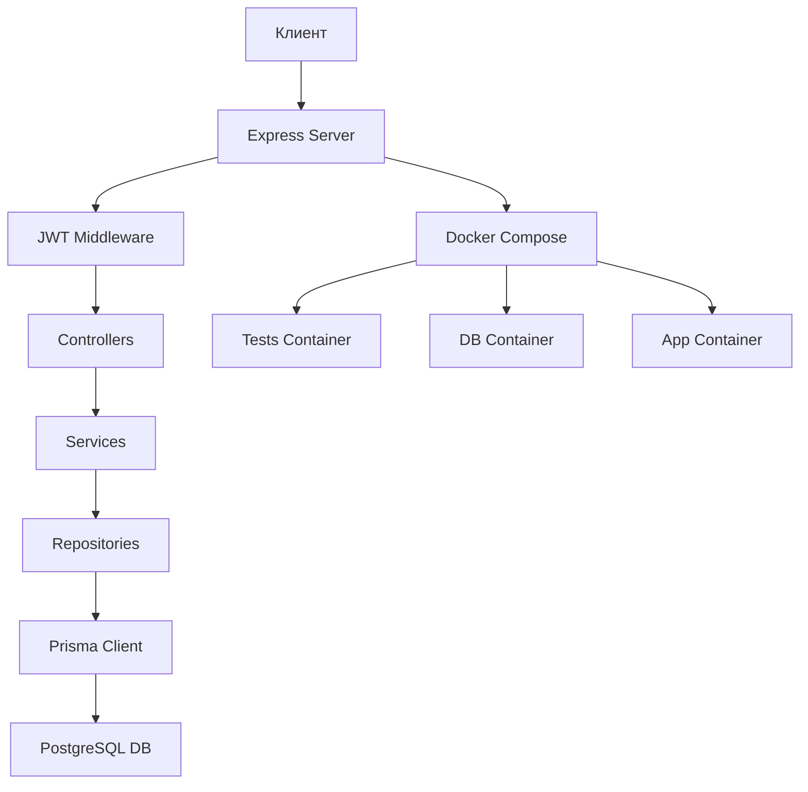
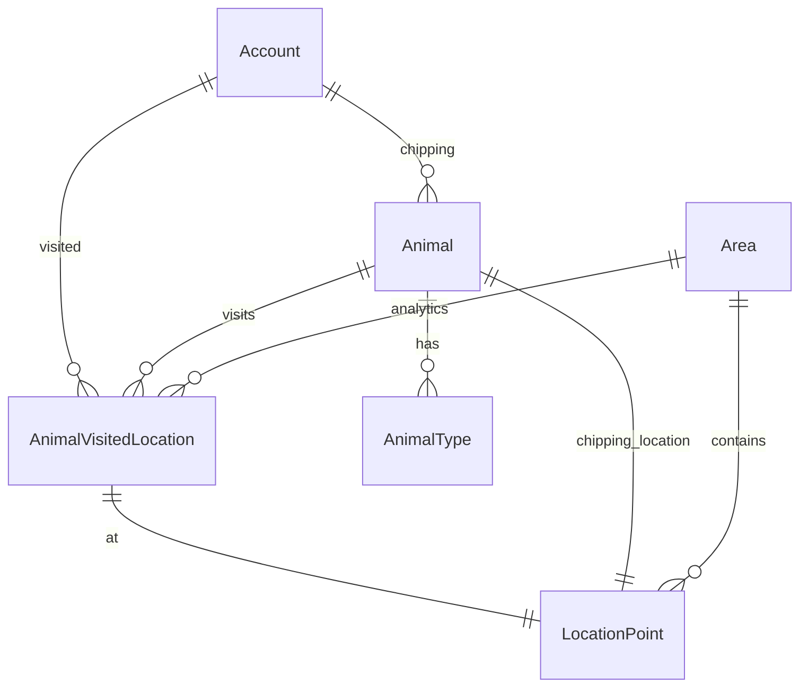

# План архитектуры REST API сервиса для отслеживания животных

## Обзор проекта
Проект представляет собой RESTful API сервис для компании "Дрип-Чип" по отслеживанию перемещений животных. Реализуется на TypeScript с использованием Node.js, Express и PostgreSQL.

## Технологии
- **Backend**: Node.js, Express
- **База данных**: PostgreSQL (latest)
- **ORM**: Prisma
- **Аутентификация**: JWT
- **Хеширование паролей**: bcrypt
- **Контейнеризация**: Docker, docker-compose
- **Тестирование**: Автотесты через Docker, собственные тесты аналогичные автотестам

## Архитектура приложения



## Структура проекта
```
animals_area/
├── prisma/
│   └── schema.prisma
├── src/
│   ├── app/
│   │   └── app.ts  # Инициализация приложения
│   ├── controllers/
│   ├── services/
│   ├── repositories/
│   ├── middleware/
│   ├── utils/
│   ├── routes/
│   ├── config/
├── tests/
├── dist/
├── node_modules/
├── Dockerfile
├── docker-compose.yml
├── package.json
├── tsconfig.json
└── .gitignore
```

## Этапы реализации

### Нулевой этап
- Создание ролей: ADMIN, CHIPPER, USER
- Автоматическое создание дефолтных аккаунтов при запуске
- JWT аутентификация
- API для аккаунтов: регистрация, просмотр, поиск, обновление, удаление

### Первый этап
- Модель Area (зоны)
- API: GET/POST/PUT/DELETE /areas
- Валидация геометрии зон (непересекающиеся многоугольники)

### Второй этап
- Аналитика перемещений животных в зонах
- API: GET /areas/{areaId}/analytics
- Расчет количества животных, посещений, уходов

### Третий этап
- Полный функционал: Location Points, Animal Types, Animals, Visited Locations
- Все соответствующие API endpoints
- Разграничение прав доступа

## Модели данных



## API Endpoints
- Аутентификация: POST /registration
- Аккаунты: GET/PUT/DELETE /accounts, GET /accounts/search, POST /accounts
- Зоны: GET/POST/PUT/DELETE /areas, GET /areas/{areaId}/analytics
- Точки локации: GET/POST/PUT/DELETE /locations
- Типы животных: GET/POST/PUT/DELETE /animals/types
- Животные: GET /animals, GET/POST/PUT/DELETE /animals/{animalId}, GET /animals/search, POST/DELETE /animals/{animalId}/types, PUT /animals/{animalId}/types
- Посещенные локации: GET /animals/{animalId}/locations, POST/PUT/DELETE /animals/{animalId}/locations

## Docker настройка
- Сервис базы данных: postgres:latest
- Сервис приложения: Node.js
- Сервис тестов: mrexpen/planet_olymp_phase2
- Сохранение образа: docker save

## Тестирование
- Локальное тестирование через docker-compose up
- Автоматическая проверка на http://localhost:8090
- STAGE: 0,1,2,3 или all

## План выполнения
1. Установка зависимостей
2. Настройка структуры проекта
3. Определение моделей БД с Prisma
4. Подключение к PostgreSQL
5. Реализация нулевого этапа
6. Реализация первого этапа
7. Реализация второго этапа
8. Реализация остального функционала
9. Валидация и обработка ошибок
10. Создание тестов
11. Настройка Docker
12. Тестирование с автотестами